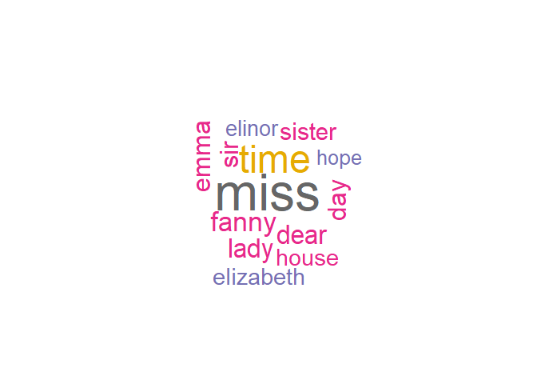

Text Analyis
================

Your mission
============

Perform text analysis.

Okay, I need more information
-----------------------------

Perform sentiment analysis or topic modeling using text analysis methods as demonstrated in the pre-class work and in the readings.

Okay, I need even more information.
-----------------------------------

Do the above. Can't think of a data source?

-   `gutenbergr`
-   `AssociatedPress` from the `topicmodels` package
-   `NYTimes` or `USCongress` from the `RTextTools` package
-   Harry Potter Complete 7 Books text \`\`\` if (packageVersion("devtools") &lt; 1.6) { install.packages("devtools") }

devtools::install\_github("bradleyboehmke/harrypotter") \`\``- [State of the Union speeches](https://pradeepadhokshaja.wordpress.com/2017/03/31/scraping-the-web-for-presdential-inaugural-addresses-using-rvest/) - Scrape tweets using [`twitteR\`\](<https://www.credera.com/blog/business-intelligence/twitter-analytics-using-r-part-1-extract-tweets/>)

Analyze the text for sentiment OR topic. **You do not need to do both**. The datacamp courses and [Tidy Text Mining with R](http://tidytextmining.com/) are good starting points for templates to perform this type of analysis, but feel free to *expand beyond these examples*.

Timelines and Task
==================

We will spend the next 2 weeks working on analyzing textual data in R. You will do the following:

-   Start with some text based data.
-   Clean data and prepare it for analysis
-   Ask questions about the data
-   Answer these questions with the data using tables and graphics
-   Each group member must have their own unique question that they code the answer for.

``` r
#install.packages("janeaustenr")  # for book by janeaustenr
#install.packages("gutenbergr")  # for free ebooks
#install.packages("dplyr")  # for data manipulation
#install.packages("stringr")  # for string manupulation
#install.packages("tidytext")  # for text mining
#install.packages("SnowballC") # for text stemming
#install.packages("ggplot2")  # for text stemming
#install.packages("wordcloud") # word-cloud generator 
#install.packages("RColorBrewer") # color palettes
```

``` r
library(janeaustenr)
library(gutenbergr)
library(dplyr)
library(stringr)
library(tidytext)
library(ggplot2)
library(wordcloud)
library(RColorBrewer)
```

Let’s start with that, and also use mutate() to annotate a linenumber quantity to keep track of lines in the original format and a chapter (using a regex) to find where all the chapters are.

``` r
#cleaning data
# Convert the text to lower case
# Remove english common stopwords eg the, for, e.t.c
original_books <- austen_books() %>%
  group_by(book) %>%
  mutate(linenumber = row_number(),
         chapter = cumsum(str_detect(text, regex("^chapter [\\divxlc]",
                                                 ignore_case = TRUE)))) %>%
  ungroup()

original_books
```

    ## # A tibble: 73,422 x 4
    ##                     text                book linenumber chapter
    ##                    <chr>              <fctr>      <int>   <int>
    ##  1 SENSE AND SENSIBILITY Sense & Sensibility          1       0
    ##  2                       Sense & Sensibility          2       0
    ##  3        by Jane Austen Sense & Sensibility          3       0
    ##  4                       Sense & Sensibility          4       0
    ##  5                (1811) Sense & Sensibility          5       0
    ##  6                       Sense & Sensibility          6       0
    ##  7                       Sense & Sensibility          7       0
    ##  8                       Sense & Sensibility          8       0
    ##  9                       Sense & Sensibility          9       0
    ## 10             CHAPTER 1 Sense & Sensibility         10       1
    ## # ... with 73,412 more rows

restructure it in the one-token-per-row format,

``` r
tidy_books <- original_books %>%
  unnest_tokens(word, text)

tidy_books
```

    ## # A tibble: 725,054 x 4
    ##                   book linenumber chapter        word
    ##                 <fctr>      <int>   <int>       <chr>
    ##  1 Sense & Sensibility          1       0       sense
    ##  2 Sense & Sensibility          1       0         and
    ##  3 Sense & Sensibility          1       0 sensibility
    ##  4 Sense & Sensibility          3       0          by
    ##  5 Sense & Sensibility          3       0        jane
    ##  6 Sense & Sensibility          3       0      austen
    ##  7 Sense & Sensibility          5       0        1811
    ##  8 Sense & Sensibility         10       1     chapter
    ##  9 Sense & Sensibility         10       1           1
    ## 10 Sense & Sensibility         13       1         the
    ## # ... with 725,044 more rows

remove stop words; stop words are words that are not useful for an analysis, typically extremely common words such as "the", "of", "to",

``` r
data(stop_words)

tidy_books <- tidy_books %>%
  anti_join(stop_words)
```

    ## Joining, by = "word"

find the most common words in all the books as a whole.

``` r
tidy_books %>%
  count(word, sort = TRUE) 
```

    ## # A tibble: 13,914 x 2
    ##      word     n
    ##     <chr> <int>
    ##  1   miss  1855
    ##  2   time  1337
    ##  3  fanny   862
    ##  4   dear   822
    ##  5   lady   817
    ##  6    sir   806
    ##  7    day   797
    ##  8   emma   787
    ##  9 sister   727
    ## 10  house   699
    ## # ... with 13,904 more rows

create a visualization of the most common words

``` r
# plot using ggplot
word_count <- tidy_books %>%
  count(word, sort = TRUE) %>%
  filter(n > 600) %>%
  mutate(word = reorder(word, n))


# plot using word cloud
 
  wordcloud(words = word_count$word, freq = word_count$n, min.freq = 1,
          random.order=FALSE, rot.per=0.35, 
          colors=brewer.pal(8, "Dark2"))
```



\*\*\*Sentimental Analysis
