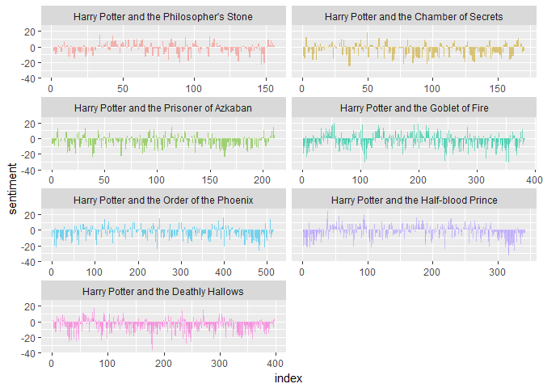
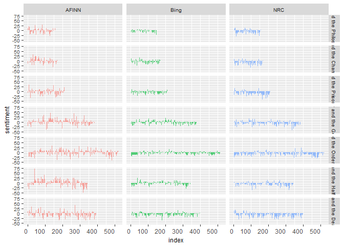

Text Analyis
================
Wei Wang
10/18/2017

Setup
=====

``` r
# Load in packages.

library(wordcloud)
library(devtools)
library(tidyverse)      
library(stringr)        
library(tidytext)
library(dplyr)
library(reshape2)
library(igraph)
library(ggraph)
library(ggplot2)

    if (packageVersion("devtools") < 1.6) {
  install.packages("devtools")
}

devtools::install_github("bradleyboehmke/harrypotter")


# Vizualization settings.
theme_set(theme_light()) # set default ggplot theme to light
fs = 15 # default plot font size
```

1.Data preparation
==================

1.1 Shape the data.
-------------------

``` r
hp_books <- c("Philosopher's Stone", 
            "Chamber of Secrets", 
            "Prisoner of Azkaban",
            "Goblet of Fire", 
            "Order of the Phoenix", 
            "Half-Blood Prince",
            "Deathly Hallows"
            )

hp_list <- list(harrypotter::philosophers_stone, 
                harrypotter::chamber_of_secrets, 
                harrypotter::prisoner_of_azkaban,
                harrypotter::goblet_of_fire, 
                harrypotter::order_of_the_phoenix, 
                harrypotter::half_blood_prince,
                harrypotter::deathly_hallows
                )
```

1.2 Place all of the books in the Harry Potter series into a tibble. Then tokenize the text into single words, strip away all punctuation and capitalization, and add columns to the tibble for the book and chapter.
---------------------------------------------------------------------------------------------------------------------------------------------------------------------------------------------------------------------

``` r
##Each book is an array in which each value in the array is a chapter 
series <- tibble()
for(i in seq_along(hp_books)) {
  temp <- tibble(book = seq_along(hp_list[[i]]),
                  text = hp_list[[i]]) %>%
    unnest_tokens(word, text) %>%
##Here I tokenize each chapter into words
    mutate(book = hp_books[i]) %>%
    select(book, everything())
  
  series <- rbind(series, temp)
}
```

1.3 Keep books in order of publication.
---------------------------------------

``` r
series$book <- factor(series$book, levels = rev(hp_books))
series
```

    ## # A tibble: 1,089,386 x 2
    ##                   book    word
    ##  *              <fctr>   <chr>
    ##  1 Philosopher's Stone     the
    ##  2 Philosopher's Stone     boy
    ##  3 Philosopher's Stone     who
    ##  4 Philosopher's Stone   lived
    ##  5 Philosopher's Stone      mr
    ##  6 Philosopher's Stone     and
    ##  7 Philosopher's Stone     mrs
    ##  8 Philosopher's Stone dursley
    ##  9 Philosopher's Stone      of
    ## 10 Philosopher's Stone  number
    ## # ... with 1,089,376 more rows

Group Question Sets
===================

1. Which is the most important charecter based on how much it was mentioned?
----------------------------------------------------------------------------

``` r
# PLOT WORD FREQUENCY PER BOOK
series %>%
  group_by(book, word) %>%
  anti_join(stop_words, by = "word") %>% # delete stopwords
  count() %>% # summarize count per word per book
  arrange(desc(n)) %>% # highest freq on top
  group_by(book) %>% # 
  mutate(top = seq_along(word)) %>% # identify rank within group
  filter(top <= 16) %>% # retain top 15 frequent words
  # create barplot
  ggplot(aes(x = -top, fill = book)) + 
  geom_bar(aes(y = n), stat = 'identity', col = 'black') +
  # make sure words are printed either in or next to bar
  geom_text(aes(y = ifelse(n > max(n) / 2, max(n) / 50, n + max(n) / 50),
                label = word), size = fs/3.5, hjust = "left") +
  theme(legend.position = 'none', # get rid of legend
        text = element_text(size = 8), # determine fontsize
        axis.text.x = element_text(angle = 45, hjust = 1, size = fs/1.5), # rotate x text
        axis.ticks.y = element_blank(), # remove y ticks
        axis.text.y = element_blank()) + # remove y text
  labs(y = "Word count", x = "", # add labels
       title = "Harry Plotter: Most frequent words throughout the saga") +
  facet_grid(. ~ book) + # separate plot for each book
  coord_flip() # flip axes
```


##### As we can imagine, Harry is the most common word in every single book and Ron and Hermione are also present. So Harry is the most important character based on how much it was mentioned.

2. Which is the most scariest book based on sentiment analysis?
---------------------------------------------------------------

``` r
# Use the nrc sentiment data set to assess the different sentiments that are represented across the Harry Potter series.
series %>%
        right_join(get_sentiments("nrc")) %>%
        filter(!is.na(sentiment)) %>%
        count(sentiment, sort = TRUE)
```

    ## # A tibble: 10 x 2
    ##       sentiment     n
    ##           <chr> <int>
    ##  1     negative 56579
    ##  2     positive 38324
    ##  3      sadness 35866
    ##  4        anger 32750
    ##  5        trust 23485
    ##  6         fear 21544
    ##  7 anticipation 21123
    ##  8          joy 14298
    ##  9      disgust 13381
    ## 10     surprise 12991

``` r
# Find how the sentiment changes over the course of each novel.
series %>%
        group_by(book) %>% 
        mutate(word_count = 1:n(),
               index = word_count %/% 500 + 1) %>% 
        inner_join(get_sentiments("bing")) %>%
        count(book, index = index , sentiment) %>%
        ungroup() %>%
        spread(sentiment, n, fill = 0) %>%
        mutate(sentiment = positive - negative,
               book = factor(book, levels = hp_books)) %>%
        ggplot(aes(index, sentiment, fill = book)) +
          geom_bar(alpha = 0.5, stat = "identity", show.legend = FALSE) +
          facet_wrap(~ book, ncol = 2, scales = "free_x")
```



##### From the graph, we can find that Deathly Hallows is the most scariest books based on sentiment analysis.

3. What are the top ten used words in exception to stop words?
--------------------------------------------------------------

``` r
used_words <- series %>%
  group_by(word) %>%
  anti_join(stop_words, by = "word") %>% # delete stopwords
  count() # summarize count per word per book
# Plot the top ten used words in exception to stop words
words_freq <- as.data.frame(used_words )   
ggplot(subset(words_freq, n>1600), aes(x = reorder(word, -n), y = n)) +
          geom_bar(stat = "identity") + 
          theme(axis.text.x=element_text(angle=45, hjust=1)) +
          labs(y = "Word count", x = "", # add labels
          title = "Harry Plotter: Top ten used words in exception to stop words")
```


4. Sentiments by books
----------------------

``` r
afinn <- series %>%
        group_by(book) %>% 
        mutate(word_count = 1:n(),
               index = word_count %/% 500 + 1) %>% 
        inner_join(get_sentiments("afinn")) %>%
        group_by(book, index) %>%
        summarise(sentiment = sum(score)) %>%
        mutate(method = "AFINN")

bing_and_nrc <- bind_rows(series %>%
                  group_by(book) %>% 
                  mutate(word_count = 1:n(),
                         index = word_count %/% 500 + 1) %>% 
                  inner_join(get_sentiments("bing")) %>%
                  mutate(method = "Bing"),
          series %>%
                  group_by(book) %>% 
                  mutate(word_count = 1:n(),
                         index = word_count %/% 500 + 1) %>%
                  inner_join(get_sentiments("nrc") %>%
                                     filter(sentiment %in% c("positive", "negative"))) %>%
                  mutate(method = "NRC")) %>%
        count(book, method, index = index , sentiment) %>%
        ungroup() %>%
        spread(sentiment, n, fill = 0) %>%
        mutate(sentiment = positive - negative) %>%
        select(book, index, method, sentiment)

bind_rows(afinn, bing_and_nrc) %>%
        ungroup() %>%
        mutate(book = factor(book, levels = hp_books)) %>%
  ggplot(aes(index, sentiment, fill = method)) +
  geom_bar(alpha = 0.65, stat = "identity", show.legend = FALSE, col = "pink") +
  facet_grid(book ~ method) +
  theme(legend.position = 'none', # get rid of legend
        text = element_text(size = 9), # determine fontsize
        axis.text.x = element_text(hjust = 1, size = 9))
```



5. Sentiment by popularity based Guardian data.
-----------------------------------------------

And the sixth question is unique for every student.
---------------------------------------------------

2.1 Wordcloud
-------------

``` r
series %>%
  group_by(word) %>%
  count() %>% # summarize count per word
  mutate(log_n = sqrt(n)) %>% # take root to decrease outlier impact
  with(wordcloud(word, log_n, max.words = 100))
```


3. Sentiment analysis
=====================

3.1 Sentiment analysis by word.
-------------------------------

``` r
# Identify all words that occur both in the books and the dictionaries and combines them into a long dataframe.
hp_sentiment <- bind_rows(
# 1 AFINN 
  series %>% 
    inner_join(get_sentiments("afinn"), by = "word") %>%
    filter(score != 0) %>% # delete neutral words
    mutate(sentiment = ifelse(score < 0, 'negative', 'positive')) %>% # identify sentiment
    mutate(score = sqrt(score ^ 2)) %>% # all scores to positive
    group_by(book,  sentiment) %>% 
    mutate(dictionary = 'afinn'), # create dictionary identifier
# 2 BING 
  series %>% 
    inner_join(get_sentiments("bing"), by = "word") %>%
    group_by(book, sentiment) %>%
    mutate(dictionary = 'bing'), # create dictionary identifier
# 3 NRC 
  series %>% 
    inner_join(get_sentiments("nrc"), by = "word") %>%
    group_by(book, sentiment) %>%
    mutate(dictionary = 'nrc') # create dictionary identifier
)

# EXAMINE FIRST SENTIMENT WORDS
hp_sentiment %>% head()
```

    ## # A tibble: 6 x 5
    ## # Groups:   book, sentiment [2]
    ##                  book      word score sentiment dictionary
    ##                <fctr>     <chr> <dbl>     <chr>      <chr>
    ## 1 Philosopher's Stone     proud     2  positive      afinn
    ## 2 Philosopher's Stone perfectly     3  positive      afinn
    ## 3 Philosopher's Stone     thank     2  positive      afinn
    ## 4 Philosopher's Stone   strange     1  negative      afinn
    ## 5 Philosopher's Stone  nonsense     2  negative      afinn
    ## 6 Philosopher's Stone       big     1  positive      afinn
